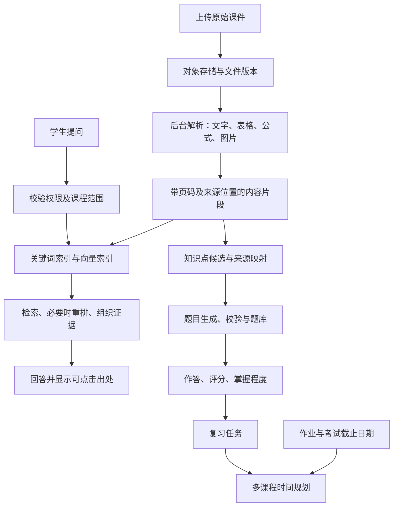

# 大学课程学习管理平台：技术调研与上线方案

调研日期：2026-10-03。使用场景：先个人使用，再邀请少量同学；首批用户在澳大利亚及其他海外地区。默认时区 Australia/Melbourne，允许每个用户和课程配置时区。

本文件是设计建议，不是已实现的软件。已查阅官方文档和研究项目；尚未使用实际课件对解析、检索、出题或判题进行实验。预算和工期是工程估算，不是厂商报价或容量承诺。

## 1. 推荐决策

采用“自建学习流程 + 托管基础服务”的响应式 Web 应用，先完成单门课程的学习闭环，再扩展多课协调和邀请制共享。前期不训练大模型，不做原生手机 App，不需要 Kubernetes。

推荐组合：Next.js / TypeScript 前端和业务接口；Supabase 提供 Auth、Postgres、pgvector、Storage、Queues、Cron；独立 Python worker 处理解析与出题；Docling 作为首个解析候选，MinerU 作为复杂课件的对照候选；Gotenberg 转换 Office 预览；PDF.js 展示 PDF；大模型与 embedding 接口按实测选择并封装为可替换接口。

这里的核心产品能力是：课程资料有出处 → 可以提问 → 知识点可以检测 → 薄弱点进入复习计划 → 复习和作业共享时间预算。

## 2. 功能范围和实现边界

| 模块 | 第一版必须有 | 后续扩展 |
| --- | --- | --- |
| 课程 | 学期、课程、课程资料、私人空间 | 邀请成员、共享资料、课程模板 |
| 文件 | PDF/PPT/PPTX 上传，PDF 预览、状态、失败重试 | DOCX、图片、表格、音视频 |
| 课程问答 | 当前课程检索、回答出处、点击跳转页码、证据不足提示 | 跨课程对照、图表问答、笔记关联 |
| 知识点 | 提取候选点、来源页、人工合并/拆分/纠错 | 先修关系、课程大纲覆盖检查 |
| 测评 | 每个已确认知识点至少 5 道经校验的不同难度题、解析、作答记录 | 参数化变式、知识追踪、自适应选题 |
| 掌握程度 | 分数、评级、证据充分度、薄弱点标红 | 遗忘模型、长期趋势、复习时机优化 |
| 日历 | 截止日期、倒计时、站内及邮件提醒、多课周视图 | 日历订阅、学校 LMS 同步、双向同步 |
| 时间协调 | 预计耗时、可学习时段、工作量冲突、计划建议 | 更复杂的约束优化和自动重排 |

“第一版”是首个可用闭环，不要求一次性覆盖整学期所有材料。功能完整的邀请内测版在后续阶段完成。

### 2.1 文件上传、预览与解析

上传采用短期授权直传对象存储，避免大文件经过应用接口。保留原文件、预览衍生文件和解析结构三个独立版本。

| 文件类型 | 预览 | 知识提取 |
| --- | --- | --- |
| 文本型 PDF | PDF.js | 按页面、标题、段落提取，保留表格与公式位置 |
| 扫描型 PDF | PDF.js | OCR；低置信度页面显示需检查 |
| PPT/PPTX | Gotenberg/LibreOffice 转 PDF 后预览 | 提取原生文本与备注，必要时结合渲染后的幻灯片 |
| DOCX | 转 PDF 预览 | 章节、段落、表格结构解析 |
| 图片 | 原图 | OCR 与必要的视觉理解 |
| CSV/XLSX | 后续提供受限表格预览 | 按工作表和表结构处理，避免盲目拼成文本 |
| 其他格式 | 明示“仅保存/下载”或拒绝 | 不承诺自动入库 |

PDF.js 是 PDF 渲染工具；Gotenberg 的 LibreOffice 路由支持 Office 到 PDF 的转换。PPT 动画、视频及某些字体/复杂排版不能按原始放映效果保留，原文件仍应允许下载。[PDF.js](https://mozilla.github.io/pdf.js/)；[Gotenberg 转换文档](https://gotenberg.dev/docs/convert-with-libreoffice/convert-to-pdf)。

Docling 支持 PDF、Office 等输入以及结构化输出；MinerU 同样提供复杂文档提取能力。它们的支持列表不代表对你的数学公式、手写笔记和图表必然正确。用同一批课件比较后再定主解析器。[Docling 格式支持](https://github.com/docling-project/docling/blob/main/docs/usage/supported_formats.md)；[MinerU 项目](https://github.com/opendatalab/MinerU)。

解析任务状态至少包括 queued / processing / ready / partial / failed；保存错误和页级结果。限制文件字节数、页数、解压大小、执行时间和并发数。转换进程隔离运行，不执行上传文档中的宏。密码保护文件需用户解锁或提供密码。

### 2.2 每门课的 RAG 知识库

推荐处理链：

数据库可以共享；每次检索必须先限制课程、成员权限和有效文档版本。不要为每门课程启动一个数据库。Postgres 支持关键词与向量混合搜索，pgvector 可结合行级权限控制。[混合检索](https://supabase.com/docs/guides/ai/hybrid-search)；[带权限的 RAG](https://supabase.com/docs/guides/ai/rag-with-permissions)。

具体设计建议：

- 每个片段保存 course_id、document_version_id、页/幻灯片编号、标题路径、位置和内容类型；渲染版和原始页码必须可映射。
- 按教学结构切分，保留定义和例题的关联。可以从 400–800 token 的文本片段起步，用课件样本调整；这不是适用所有课件的固定最佳值。
- 结合关键词和多语言向量召回。英文课程支持中文提问；中文关键词需单独验证分词，不能把默认英文全文检索直接当作中文方案。
- 图表保留图片、图注及来源，必要时只把相关页面图像送入视觉模型。纯文本索引可能漏掉图中的教学内容。
- 引用由服务器将真实片段 ID 映射为页码，不能让模型自由编造引用。引用存在仍不等于引用能支持结论，需专门评测。
- 默认依据课程资料回答；资料缺失或相互矛盾时明确说明。允许外部补充时将补充解释与课件结论分别标记。
- 资料作为待分析内容，不能作为可执行指令；上传资料无权修改系统行为或访问其他课程。
- 替换文档后重新构建受影响的片段和知识点映射，原题目保留旧版依据并提示待审核。删除文件要同步清理索引、衍生图像和缓存。

模型选择用你的真实课程做小规模对照：比较中文/英文术语、公式解释、引用准确度、结构化输出、延迟和每次成功任务成本。常规提取和简单回答用便宜模型，复杂推导及争议判题再升级。embedding 模型改变时通常要重建向量索引，因此单独记录版本。

### 2.3 日历、时间提醒与多课协调

截止时间必须是结构化记录，不能靠模型聊天记忆。每条作业保存课程、名称、截止时间、课程时区、来源、预计剩余耗时、占分比、完成状态和用户确认状态。

导入顺序：手工录入 → 从 syllabus/作业文件提取候选 → 用户核对确认 → 后续增加 ICS 导入或订阅。没有学校接口时，系统不能自动知道老师刚刚延期；应显示数据来源及最后同步时间。只出现日期而没有时间时不能擅自填成 23:59。

数据库保存 UTC 时间，同时保留 IANA 时区（例如 Australia/Melbourne）和原始截止描述。界面同时显示绝对截止时间与相对倒计时，处理夏令时、用户旅行和课程时区差异。“今天/明天”由程序按当前时区计算。

前端显示倒计时；后端计划任务每分钟检查到期提醒，例如提前 7 天、3 天、24 小时、2 小时。站内消息加邮件作为第一版渠道，后续增加经用户授权的 Web Push。关闭网页后仍由服务器发起提醒，但邮件和推送到达设备的时间不承诺秒级准确。

Supabase Cron 可执行周期性任务，Queues 可持久化后台任务。具体发送仍需 worker 和邮件服务，不能仅创建 Cron 就认为提醒已经送达。[Cron](https://supabase.com/docs/guides/cron)；[Queues](https://supabase.com/docs/guides/queues)。

可靠性设计：提醒记录有唯一键（用户、作业版本、渠道、提前量）；截止日期修改后取消旧提醒；记录发送状态、重试次数和供应商回执。中断恢复时补查遗漏，过期任务合并为摘要以免轰炸。队列重投不能导致重复评分或重复发送；应用仍须实现幂等。

多课协调首先做可解释规则：按截止先后、占分比、剩余工作量、相关薄弱知识点与可用时段排序。固定课表和已经锁定的学习时段不可随意移动。

示例：下周三门作业分别需要 4、6、3 小时，复习需要 4 小时，合计 17 小时；可用时间只有 12 小时，则明确显示“预计缺少 5 小时”，再建议提前开始、缩减可选复习或调整计划。不得把超载任务硬塞进日历。模型可以解释建议，时段冲突和小时总量由程序校验。

第一版用按课程着色的周/月日历加截止清单。FullCalendar 部分资源时间线功能属于 Premium，不应默认所有视图免费。[插件清单](https://fullcalendar.io/docs/plugin-index)。

### 2.4 知识点、每点至少五题与掌握程度

知识点不是简单地“每页一个”：相同概念可能跨多页出现，一页也可能含多个概念。先建立可编辑清单，为每点写出可以观察的学习目标、来源和先修关系。对未审核的自动提取结果显示“候选”，不能声称完全覆盖。

每个已确认知识点至少生成五道不同题，建议五档：

| 档位 | 检测内容 | 例子：条件概率 |
| --- | --- | --- |
| 1 | 识记 | 识别定义和符号 |
| 2 | 理解 | 用自己的话解释条件改变后的样本空间 |
| 3 | 单步应用 | 使用给定数据计算 |
| 4 | 多步应用或辨错 | 找出混淆独立性与互斥性的推导错误 |
| 5 | 迁移和综合 | 在新场景建模并说明假设 |

难度是初始教学标签，要用后续作答校准；认知层次也不自动等于统计难度。题目包含标准答案、评分规则、解题步骤、误区、关联知识点、来源及质量状态。

先生成候选，再独立求解或规则校验、检查题干完整性与重复性、抽样人工审查，才能进入可测题库。一个生成模型和另一个复核模型可能一起出错，不能把“双模型通过”当作正确保证。数学题优先用可验证计算；程序题若需要执行，必须在隔离环境中运行。

如果课件信息不足以支持五道可靠题，显示“题库未齐，需要补充材料/审核”，不要凭空凑题。课程页显示“已确认知识点数、达到五题的知识点数、待审核数”，保证覆盖可检查。

评分方式：选择题和数值题尽量确定性判分；简答题按明确 rubric 给部分分，展示满足/缺失的要点。有争议或评分依据不足的答案标记待复核，并允许纠正题目、答案和评分。

早期采用透明规则，不把模型的一句评价直接存成最终能力判断。以下是可调整的产品启发式，不是经过验证的教育测量标准：

- 分别保存每次作答分数与知识点掌握估计。
- 一次首测由五档各一道题构成，每题 0–1 部分分，首测指数为 100 × 五题均分。
- 少于五道独立有效题、缺少应用层证据或评分待复核时，状态为“未完成评估/证据不足”；已经发现的错误仍进入复习建议。
- 完成首测后，低于 60 标红“需复习”；60–79 标黄“待巩固”；80 及以上标记“初步掌握”。分数边界可调整。
- 绿色“较稳固”还要求应用题通过，以及间隔一段时间后通过新题复测；若只会背定义，不能仅凭均分高标为稳固。
- 使用提示、看过答案、原题重做和新题首答分别记录。练习模式与闭卷评估模式分开；提示后作答不直接用于闭卷掌握指数。
- 后续复测使用新题的最近评估结果更新指数；保留旧记录和变化原因，不能重复刷同一题就无限加分。
- 长期未测时显示“需要复核/可能遗忘”，不要无依据地将能力直接降为不及格。

状态不只靠颜色，配文字和图标。每点应展示：指数、状态、有效题数、最近评估日期、薄弱类型和下一步练习。

积累足够真实作答序列后，再考虑 BKT 或 IRT，并用留出的数据验证。pyBKT 是可参考的贝叶斯知识追踪实现，会考虑猜对和失误等参数；这不意味着少量个人数据就足以可靠拟合模型。[pyBKT](https://github.com/CAHLR/pyBKT)。

复习先从可修改的 1/3/7/14 天间隔规则起步，错题讲解后换题复测，并让复习任务进入多课日历。该间隔是初始产品规则，需要根据使用体验调整。

## 3. 最小架构和数据模型

| 层 | 推荐 | 主要职责 |
| --- | --- | --- |
| Web | Next.js + TypeScript | 页面、鉴权后的业务接口、流式回答 |
| 数据与权限 | Supabase Postgres + Auth + RLS | 课程、成员、任务、题目和作答 |
| 文件 | 私有对象存储 | 原件、预览件、页图、备份 |
| 检索 | pgvector + 关键词检索 | 受权限限制的课程片段召回 |
| 后台任务 | Supabase Queues + Python worker | 解析、OCR、向量化、出题与重试 |
| 计划任务 | Supabase Cron + 通知 worker | 到期扫描、复习和通知 |
| 转换服务 | 私有 Gotenberg 容器 | Office 转 PDF |
| AI | 可替换的生成和 embedding 接口 | 回答、知识点提取、出题、rubric 评分 |

暂不额外引入 FastAPI、Redis 或独立向量数据库；当 Python 服务确实需要对外 API 或队列压力成为瓶颈时再增加。OCR 和 Office 转换不放进浏览器请求或长时间占用 Web 函数。

核心实体：

| 实体 | 关键关系 |
| --- | --- |
| courses / course_members | 学期、课程、所属人、成员权限 |
| documents / document_versions | 原件、版本哈希、有效状态、预览路径 |
| document_pages / chunks | 页码、位置、文本、表格、向量、课程权限范围 |
| knowledge_points / knowledge_point_sources | 学习目标、候选状态、多个来源片段 |
| questions / question_skills | 难度、rubric、题目版本、主知识点和辅助知识点 |
| attempts / attempt_scores | 用户答案、提示使用、题目版本、评分器版本和分项反馈 |
| mastery_states / review_tasks | 用户与知识点的当前估计、证据、下次复测 |
| assignments / availability / study_blocks | 截止、预计工时、可用时段、计划 |
| notifications / job_runs | 幂等键、状态、错误、重试和执行记录 |
| conversations / answer_citations | 课程上下文、回答和实际使用的来源 |

跨知识点综合题用多对多关系，不能把整题失分机械扣到所有相关知识点。个人掌握程度和聊天记录默认私有，即使课件共享也不自动共享这些数据。

## 4. 三种上线策略

预算统一为 USD/月，未含税、域名及开发人力。基础设施与 AI 分开计算，所有区间均为初步预算。假设初期 1–20 名用户、最多约 2,000 页材料、每日不超过约 200 次问答、解析低并发；新增上传、批量出题和高价模型可能使费用明显超出。用户数不是容量保证。

| 路线 | 部署组成 | 基础设施预算 | AI 预留预算 | 适合与限制 |
| --- | --- | --- | --- | --- |
| A 个人低成本验证 | Vercel Hobby、Supabase Free、个人电脑解析；云端轻量提醒服务 | $0–15 | $10–30 | 可有私人网址；电脑离线时解析暂停，免费额度和休眠不适合承诺提醒可靠性 |
| B 托管服务邀请内测（推荐） | Vercel、Supabase Pro、Railway/Render 后台服务、邮件服务 | $50–120 | $20–100 | 运维较少，支持关闭网页后的提醒；后台内存和转换服务需计费 |
| C 单云服务器部署 | 一台 VPS 上运行 Web、worker、转换与 Postgres，独立对象存储/异地备份 | $35–100 | $20–100 | 支出易理解、控制较强；维护升级、恢复和单机故障由自己承担 |

官方价格锚点：Vercel Hobby 为个人非商业使用，Pro 标价 $20/月；Supabase Pro 起价 $25/月；Railway Hobby 最低 $5/月，含等值用量，超过后按资源使用收费。它们不是整个平台的包干价。[Vercel](https://vercel.com/pricing)；[Supabase](https://supabase.com/pricing)；[Railway](https://docs.railway.com/pricing/plans)。

单服务器参考：DigitalOcean 普通 Basic 档 4 GiB/2 vCPU 为 $24/月，8 GiB/4 vCPU 为 $48/月。OCR/转换与数据库共用机器时，建议先以 8 GiB 做低并发实验，再依据峰值调配；不能据此保证能运行任意解析模型。[DigitalOcean 价格](https://www.digitalocean.com/pricing/droplets)。

路线 B 的具体预算起点可以是：数据库 $25 + 前端 $0 或 $20 + 后台处理/转换 $20–60 + 通知与额外存储 $5–15。先把总预算目标设为约 $100/月，并设置独立 AI 限额；若常驻解析模型内存高，需提高预算、按需启动或改为批量本地解析。

地域选择：Supabase 提供 Sydney 和 Singapore，Railway 提供 Singapore。若采用 Railway，初期应用服务与数据库尽量集中 Singapore，避免后台大量跨区访问；若选择 Sydney 数据库，应配附近计算资源并实测延迟。澳洲数据库并不代表外部 AI 请求也在澳洲处理。[Supabase 地区](https://supabase.com/docs/guides/platform/regions)；[Railway 地区](https://docs.railway.com/deployments/regions)。

路线 A 仅用于验证。正式依赖系统提醒作业时，迁移到 B 或 C 的持续运行服务。不要把本地电脑开机作为核心提醒的前提。

### 可复用开源系统的取舍

RAGFlow 可以作为知识库原型或独立检索服务候选；它不能直接替代这里的题库、掌握程度和多课时间规划业务。官方建议起步配置约 4 核 CPU、16 GB 内存、50 GB 磁盘，因此不作为最低预算方案默认组件。[RAGFlow](https://github.com/infiniflow/ragflow)。

Moodle 已有题库、测验和日历，若目标变为教师管理班级，可考虑在其上增加课程 RAG 和测评插件。针对个人学习体验，仍需改造交互和学习模型，未必比小型自建应用更省事。[Moodle 测验](https://docs.moodle.org/en/Quiz_activity)；[Moodle 日历](https://docs.moodle.org/en/Calendar)。

## 5. 开发与发布顺序

以下按一位熟悉全栈、能持续投入的开发者估算。初学者、兼职开发或大量数学/扫描件需更长时间；AI 辅助编码不能替代数据验证。

| 阶段 | 估算投入 | 可验证交付 |
| --- | --- | --- |
| 0 技术验证 | 3–5 个工作日 | 选 10–20 份代表课件，对照两个解析器，记录漏字、公式、页码和成本 |
| 1 单课可用版本 | 约 2–3 周 | 登录、一门课、PDF/PPT 上传预览、引用问答、手填作业及邮件提醒；一份课件完成五题测评闭环 |
| 2 完成学习系统 | 约 2–3 周 | 多课管理、知识点审核、每点五题覆盖、分级反馈、复习计划、工作量冲突 |
| 3 邀请制内测 | 约 1–2 周 | 成员隔离、共享设置、任务恢复、成本限额、备份恢复、5–20 人试用 |

可供少量同学持续使用的版本预计约 6–10 周，具体由阶段 0 的解析难度和可投入时间修正。先完成一个真实课程单元的纵向流程，再批量覆盖整个学期。

发布方式：先自己的真实课程试用 → 邀请 5 位同学并限制课程和上传量 → 稳定后扩大到约 20 人 → 再决定是否公开注册。每一步都观察正确性、使用价值和费用，不单按日历日期扩大用户。

## 6. 上线验收与成本控制

建议最小验证集：选 10–20 份课件，覆盖英文、中文、扫描、双栏、公式、表格、图片和 PPT 备注；人工准备至少 50 个可追溯问答和若干资料无法回答的问题。测试集保留一部分不参与提示词调试。

以下为建议验收门槛，不是当前实测成绩：

- 引用：来源链接和页码全部能打开；50 个基准问题中至少 90% 的回答经人工确认结论正确且引用支持结论。资料不足样本不允许编造事实。
- 解析：关键页的公式、图表、标题和内容顺序经过核对；不支持或失败的内容明确可见。
- 测评：每个确认知识点达到五题或明确显示缺口；候选题不得冒充已校验题；评分与人工 rubric 对照，争议题可撤回和重算。
- 权限：两账号交叉访问课程、文件直链、检索和聊天接口，不得读取未授权内容。
- 日历：验证墨尔本夏令时、跨时区、延期、取消、已完成和系统中断恢复；健康运行时提醒任务在计划时间后两分钟内入发送队列，外部邮件送达另行记录。
- 任务：进程重启不丢已入队任务；重试不重复扣额度、出题或发通知；超过重试次数后可见并可人工恢复。
- 备份：能在新环境恢复数据库和抽样课件。Supabase 数据库备份不包含 Storage 文件实体，文件备份需另做。[备份说明](https://supabase.com/docs/guides/platform/backups)。

成本不是简单“用户数 × 会员费”。建议分别记录文档页数、OCR/视觉调用、embedding tokens、问答输入/输出 tokens、生成及复核题数、worker 内存与运行时间、下载流量。

假设 4 门课 × 12 份课件 × 每份 20 个候选知识点 × 每点 5 题，未去重前就是 4,800 道候选题。这只是规划示例，不是你的实际课件统计；复核、失败重试和题目变式还会继续增加工作量。

控制方法：先去重和确认知识点，分批生成且可暂停；同一文件版本不重复解析和向量化；每用户每日问答/上传配额；按任务设置 token 与页数上限；达到应用预算阈值后暂停非必要批量任务并提示。供应商支出告警不一定是硬性阻断，应用自身也需要限额。

## 7. 进入开发前仍需决定的事项

当前已有方向足够进行阶段 0，以下信息会影响后续细化：课程学科（尤其数学/编程/图表比例）、典型课件大小和扫描件占比、可投入时间、每月预算上限、是否需要共享原始课件，以及学校是否提供可用的日历导出。

优先补充实际课件样本和作业日期样本，用它们决定解析器与模型；平台首版按个人课程资料默认私有、邀请后显式共享来设计。
