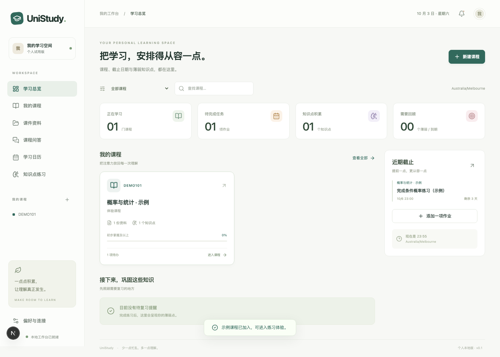

# UniStudy · University Learning Platform

A local, single-user university learning workspace: course files, source-backed Q&A, assignment planning, and knowledge-point practice.

一个可以在本机直接试用的大学课程学习工作台。**当前没有登录系统，仅监听本机；公开仓库存放源代码，不存放课件、密钥或学习数据。**



## 快速开始

需要 **Node.js 24 或更新版本**（使用内置 SQLite）。

```bash
npm ci
cp .env.example .env.local
npm run dev
```

打开 **http://127.0.0.1:3000**。启动命令同时运行网站和后台 worker。关闭终端会停止两者；按 `Ctrl+C` 停止。仅刷新或关闭网页不会清空数据。

第一次可以点击「载入示例」，体验资料检索、五档单选题和日历；示例课程会明确标注，也可以整门删除。没有 AI 密钥也能使用课程、课件、日历、手动题库和原文检索。

生产构建同样供本机使用：

```bash
npm run build
npm start
```

## 目前能做什么

| 模块       | 已实现                                                                  |
| ---------- | ----------------------------------------------------------------------- |
| 学习总览   | 课程数、待办、知识点、薄弱/到期复习概览；实时日期                       |
| 我的课程   | 新增、编辑、颜色、学期、删除及关联数据清理                              |
| 课件资料   | 上传、持久化、解析队列、状态、重试、下载、预览；最大 25 MB / 300 页 PDF |
| 文本提取   | 文本型 PDF、PPTX、DOCX、TXT、Markdown；保存页/幻灯片来源                |
| 原排版预览 | PDF 内嵌预览；配置 LibreOffice 后转换 PPT/PPTX/DOCX                     |
| 原文检索   | 课程隔离的关键词检索，中英文分词；未配置 AI 时明确显示原文片段          |
| RAG 问答   | 可配置模型生成回答，展示真实来源链接；可选向量与关键词混合检索          |
| 知识点     | 手工建立、编辑、确认；AI 从课件提取最多 12 个候选点                     |
| 题库       | 手工单选题；AI 生成五个难度的候选单选题，人工核对后批准                 |
| 测评       | 确定性单选判分、答案解析、作答历史入库、证据不足/红黄评级、复习到期     |
| 日历       | 多课程月历、作业新增/编辑/完成、时区与夏令时、剩余时间                  |
| 工作量协调 | 根据截止与每日学习小时数安排未来七天，显示无法排入的工作量              |
| 提醒       | 7 天 / 3 天 / 24 小时 / 2 小时 / 逾期，站内通知，可选 SMTP 邮件         |
| 个人设置   | 时区、每日可用小时、模型状态、AI 每日调用计数                           |

## 连接 AI（可选）

编辑 `.env.local`，填写你使用的 **OpenAI-compatible Chat Completions** 服务：

```dotenv
AI_BASE_URL=https://api.openai.com/v1
AI_API_KEY=在这里填写自己的密钥
AI_MODEL=你账户可用的文本模型名称
EMBEDDING_MODEL=
AI_DAILY_LIMIT=100
```

模型名称不硬编码，须使用服务商实际支持的名称。服务需接受 `messages` 和 `max_completion_tokens`；接口不兼容时会明确报错，不会伪造 AI 结果。本地兼容服务可以使用 `http://127.0.0.1:端口/v1`；如果本地服务不验密钥，填入一个非空占位值即可。

`EMBEDDING_MODEL` 可选。配置后，新解析文档生成向量并使用混合检索。旧文档需要在课件页点击重新解析。更换向量模型也需重新解析；旧模型向量不会被混用。

每次模型请求在发出前原子预占今日调用额度（按 UTC 日期），失败请求也计入本地限额。此限额控制请求数，**不是美元金额或 token 硬上限**。服务商实际费用另计。模型处理时会收到相关课件片段，请选择自己信任的服务。

环境变量由网站和 worker 在启动时加载，修改后请重启。密钥不会通过状态接口传回浏览器，也不应写进代码或截图。

参考：[Chat Completions](https://platform.openai.com/docs/api-reference/chat/create)、[Embeddings](https://developers.openai.com/api/docs/guides/embeddings)。选择兼容接口是为了支持不同供应商，后续可增加 Responses 或其他专用适配器。

## PPT 与文件预览

PDF 直接在浏览器里预览。PPTX 默认提取幻灯片文字，DOCX 默认提取正文；两者在未转换时显示**文字预览**，不会宣称保留原排版。旧版 `.ppt` 需要 LibreOffice。

如果已安装 LibreOffice，填写实际可执行文件路径：

```dotenv
# macOS Homebrew 示例
SOFFICE_PATH=/opt/homebrew/bin/soffice
# Linux 常见路径：/usr/bin/libreoffice
```

重新解析后会生成 PDF 预览。字体和复杂排版可能与 PowerPoint 不同；动画不保留。原始文件始终可下载。Office 在独立的 headless 进程转换，应用本身只用于个人可信课件，尚未实现面向公共上传的容器沙箱。

**当前限制：**扫描 PDF、图片内文字、复杂公式/图表视觉理解没有实现 OCR；图片仅可预览。PPTX 目前提取幻灯片正文，不提取演讲者备注；未转换的 DOCX 用一个正文段落表示，不能映射真实页码。PDF 文字层本身错误时也可能提取错误。

## 学习评级如何计算

每个知识点取最近最多 10 道不同题的**首次独立作答**。同一题再做不会提升该题的掌握证据；使用提示或已看过答案时勾选相应选项，该作答仅记录为练习。

- 少于 5 道有效题，或缺少难度覆盖和应用题：证据不足。
- 覆盖至少 3 个难度、至少 2 道应用题后：低于 60 需复习，60–79 待巩固，80 及以上初步掌握。
- 绿色“较稳固”还需要至少隔一天的新应用题通过，且当前应用题证据均达到要求。
- 按状态安排 1 / 3 / 7 / 14 天后复核提醒。生成新题可以用于间隔复测。

分数是可解释的早期产品规则，不是经过标定的心理测量模型。自动题目只有结构检查和人工批准流程，**没有独立模型求解验证或数学证明**。首版只做单选题，没有自由简答评分。

候选知识点每次最多 12 个；超过 24 个片段的长课件采用抽样，可能遗漏内容。应人工核对并补充知识点。每点题量有显示，但不会保证 AI 已经发现课件里的所有知识点。

## 截止时间、邮件与后台任务

截止日期由用户确认，数据库存 UTC，另存课程时区。遇到夏令时不存在或重复的本地时间会拒绝保存，要求选择无歧义的时间。系统不接学校账号，不会自动知道老师延期。

后台每 30 秒检查提醒并生成站内通知。错过多个提醒阶段时只补发当前阶段，避免一次性发送多封；同一任务版本和阶段有唯一键防止正常重复。修改截止或完成任务会取消旧通知。

可选邮件配置：

```dotenv
SMTP_HOST=smtp.example.com
SMTP_PORT=587
SMTP_SECURE=false
SMTP_USER=你的账号
SMTP_PASS=你的邮件服务密码
SMTP_FROM=UniStudy <study@example.com>
REMINDER_EMAIL=接收提醒的邮箱
```

失败邮件显示在提醒列表，可手动重试；不无限重发。应用崩溃在发送与保存回执之间时，无法保证邮件严格只发送一次，“发送中”记录需人工判断后重试。关机、休眠、断网时邮件不会按时送达；此版不是云端常驻提醒服务。

解析和出题任务保存在 SQLite 中，有任务租约和异常状态；进程中断后可恢复过期任务，失败任务可从对应功能重新提交。一个 worker 顺序处理文档以控制资源使用，提醒检查独立触发。

## 数据与备份

```text
data/
  study.sqlite        # 课程、题库、作答、日历、聊天、任务
  uploads/            # 课件原文件
  previews/           # 转换出的 PDF
```

备份：先按 `Ctrl+C` 停止应用，再复制整个 `data/` 目录。恢复：停止应用后，将备份放回同一路径。不要只拷贝运行中的数据库文件而忽略 WAL。可以用 `DATA_DIR` 更改数据位置。

`.gitignore` 排除 `.env.local`、数据库、上传文件、构建产物和浏览器测试结果。勿把自定义 `DATA_DIR` 设置为会被 Git 跟踪的目录。

## 技术结构

- Next.js App Router、React、TypeScript；本机 Node.js 进程。
- SQLite WAL 与外键约束；少量数据用本地关键词召回、可选向量余弦相似度与排名融合。
- 独立 `tsx` worker；数据库持久化任务队列、租约和每日模型调用限额。
- `pdf-parse` 提取 PDF，`adm-zip` 与 `fast-xml-parser` 提取 Office 正文，LibreOffice 可选转换。
- `luxon` 处理 IANA 时区和夏令时；`nodemailer` 发送可选邮件。

```text
src/app/                   页面、全局样式、统一 API 路由
src/components/            工作台 UI、表单、预览、日历和练习
src/lib/                   数据库、解析、检索、AI、题库和提醒
scripts/worker.ts          后台任务入口
tests/core.test.ts         业务和解析集成测试
tests/e2e/                 浏览器操作测试
PLATFORM_RESEARCH.md       原始完整产品调研（包含后续阶段设计）
```

调研中的 Supabase、Python worker 和云端部署是后续扩展选项；本次为个人试用缩减为一个 Node.js 项目和本地 SQLite，避免创建云账号。

## 验证

```bash
npm run typecheck
npm test
npm run build
npm exec playwright install chromium
npm run test:e2e
```

核心测试覆盖：夏令时、独立作答与重复作答、超载排程、课程检索隔离、文本/PDF/PPTX 提取、任务恢复、提醒去重、示例数据及级联删除。AI 接口测试使用本机模拟服务校验协议与持久化，不消耗真实额度，也不证明真实模型的回答质量。

浏览器测试覆盖课程创建、上传、预览、问答原文、作业完成、五题测评、刷新后持久化、移动端溢出检查和跨站请求拒绝。

## 后续扩展

- 使用真实课件验证 OCR、公式和图表；完善 PPT 备注与解析质量提示。
- 扩展开放式题目、评分 rubric、独立出题验证与更完整的知识点覆盖。
- 具体空闲时段排课、复习任务入日历、ICS 导入和学校系统同步。
- 多用户之前增加登录、课程成员、资料权限、对象存储和备份恢复工具。
- 正式云端部署之前增加上传沙箱、运营监控及提醒服务的可靠性保障。

当前版本不要直接暴露到公网；后续加入登录与权限后再开放多人使用。
